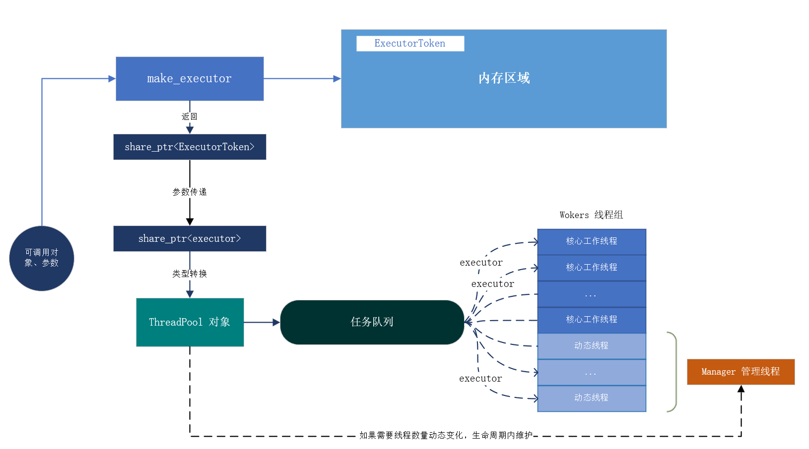

# [muse-threads](#)
一个基于C++ 11、支持任务批量提交、header-only的线程池，提供了基于 `std::queue` 和 无所队列[concurrentqueue](https://github.com/cameron314/concurrentqueue)的两个版本。

**线程池设计图：**



使用例子：
```cpp
ThreadPool<ThreadPoolType::Flexible, 1024, 8> pool(4, ThreadPoolCloseStrategy::WaitAllTaskFinish);

//将任务包装成一个执行器
auto executor = make_executor([](int i)->int{
    std::this_thread::sleep_for( std::chrono::milliseconds(5));
    return i * i;
}, 4000);
//提交执行器
auto commitResult = pool.commit_executor(executor);
//如果提交成功
if (commitResult.isSuccess){
    //执行过程中没有异常
    if (!executor->isError()){
        //获取结果
        std::cout << "result :" << executor->get() << std::endl;
    }
}

```


